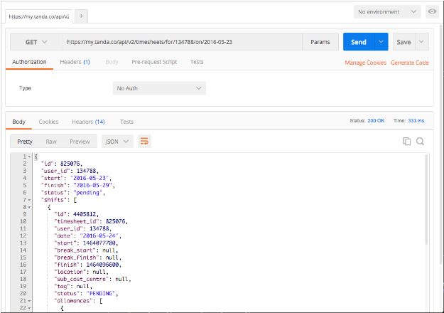
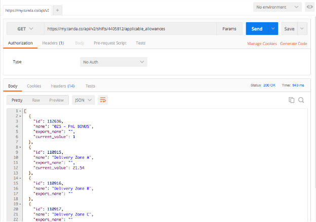
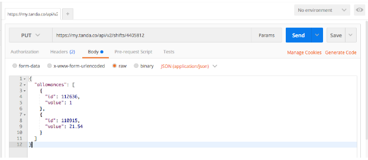
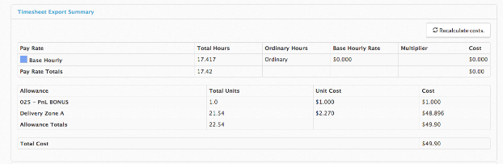

Tanda uses the concept of **Allowances** to manage items that are tied to a shift but are in distinct units (not hours). For example, the number of kilometres driven, or the number of sheep sheered, during a shift.

Shifts are implicitly created when sending clock-ins through the API. Allowances are a way of noting extra attributes, that aren’t related to the specific times worked, to a shift.

Allowances are not provided when clocking in. Instead, you can set allowances for a shift, either when you are creating a shift, or when updating it.

The first step is finding which shift you want to update. You can use the Get Timesheet For User on Date method to find a timesheet if you know the user and date you are making changes for. This will give you a URL that looks like https://my.tanda.co/api/v2/timesheets/for/134788/on/2016-05-23 and a response that looks like:



From here you can find the appropriate shift, based on the date you are making changes for. Each shift has an `id`. You can then query the API which allowances can be attached to a shift, by `GET`ting a URL that looks like https://my.tanda.co/api/v2/shifts/4405812/applicable_allowances



In this response each allowance has an ID and a name. Use the name or export name to identify the allowance you want to set. Then, make a `PUT` request to the shift with these allowances.



The JSON formatting should be similar to:

```
{
  "allowances": [
    {
      "id": 987654,
      "value": 1
    }
  ]
}
```

This example is also in the [API documentation](https://my.tanda.co/api/v2/documentation#shifts-shift-put), on the "update shift allowances" tab in the right corner.

Once you have made this PUT, the API will return an updated copy of the shift, which should include the allowances you sent. You can also view the timesheet in Tanda to confirm that it has updated. The returned shift will include a `timesheet_id`, use it to get to the timesheet's URL, for example https://my.tanda.co/timesheets/825076



If you want to change an allowance's value later, just make a `PUT` to the Shift again with an updated value. If you want to delete it, make a PUT with value `0` (zero).
