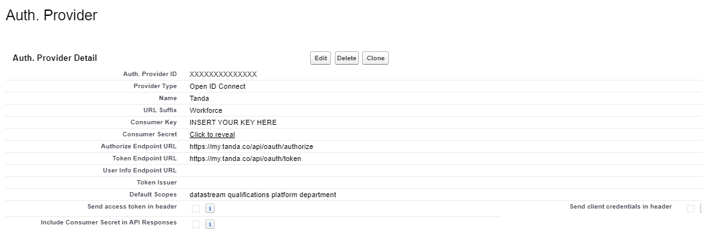
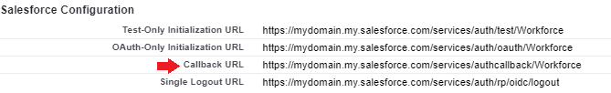
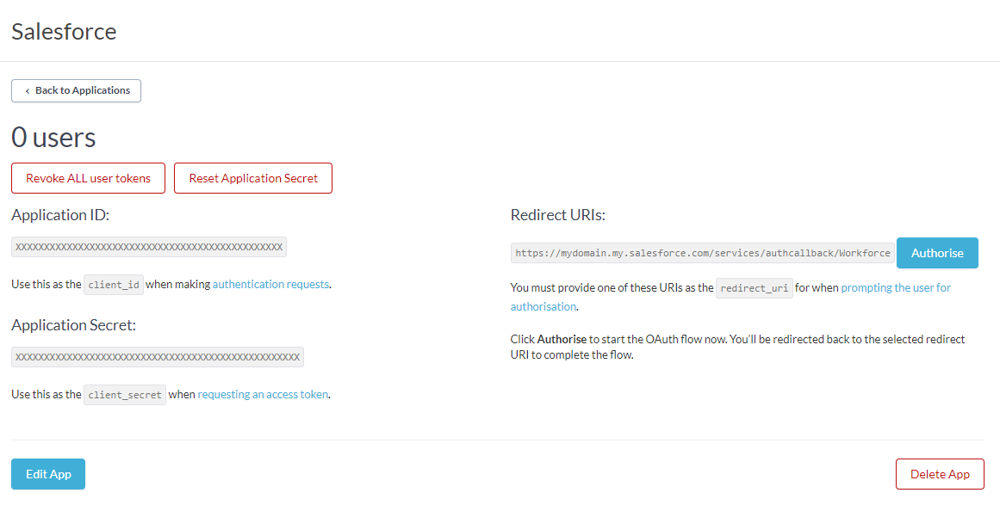
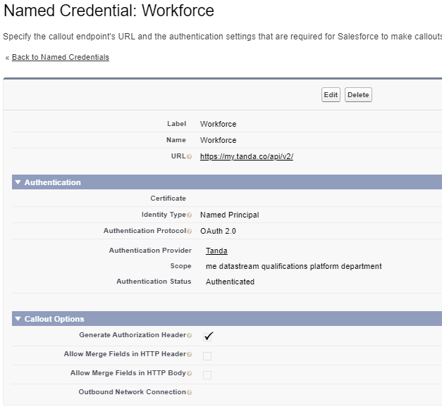

# Salesforce to Workforce Integration Using Oauth 2.0

---

## Creating the connection

This section will help you create an Oauth connection between Salesforce and Workforce, allowing you to send and receive callbacks from [Tanda API](https://my.tanda.co/api/v2/documentation)

### 1. Setup the Auth Provider in Salesforce (Setup > Identity > Auth Provider)**

Enter in dummy data in the key and secret fields so you can create the provider (you will get these after you setup the Workforce Oauth application)
    
    

### 2. Setup the Oauth Application in Workforce at the [My Workforce Applications](https://my.workforce.com/api/oauth/applications) page**

Use the Callback URL from above to create your application
Get the Application ID and Application Secret, and add them to the Salesforce Auth Provider you created
    

### 3. Setup Named Credentials using your new Auth Provider.(Setup > Security > Named Credentials)**

The connection should be established when you save the Named Credentials
    

---

## Developing the Integration

If you are new to Salesforce and need some guidance on the Apex language use these links.

- [Trail - Developer Beginner](https://trailhead.salesforce.com/en/content/learn/trails/force_com_dev_beginner)
- [Developer Beginner - Code with Salesforce Languages](https://trailhead.salesforce.com/en/content/learn/modules/platform_dev_basics/platform_dev_basics_code?trail_id=force_com_dev_beginner)
- [Apex Integration Services - Apex REST Callouts](https://trailhead.salesforce.com/en/content/learn/modules/apex_integration_services/apex_integration_rest_callouts)

### - Create the WorkforceCallout class

  This class will handle making the callout to Workforce based on the endpoint and a request body if needed. These methods are meant to be generic and handle requests to any of the Workforce API endpoints provided the correct body if needed.
  
  The makeGetCallout will retrieve any list of data from Workforce. You will then have to parse the JSON received to save it.
  
  It is generally recommended to only save the Workforce Id and Workforce RecordId as other values could change in the external system and maintaining data continuity would be a headache.
  
  The makePostCallout is used in the [WorkforceLocationQueueable class](#-use-queueables-to-synchronize-the-upload). The method signature is only an endpoint and a JSON body.

```APEX
public class WorkforceCallout {
    static final String NAMED_URL = 'callout:Workforce/';
    public class WorkforceException extends Exception {
    }
 
    //pass in any of the Workforce GET endpoints to retrieve that object from Workforce
    public static HttpResponse makeGetCallout(String endpoint) {
        Http http = new Http();
        HttpRequest request = new HttpRequest();
        request.setEndpoint(NAMED_URL + endpoint);
        request.setMethod('GET');
        request.setHeader('Content-Type', 'application/json;charset=UTF-8');
        HttpResponse response = http.send(request);
        // Parse the JSON response
        if (
          response.getStatusCode() != 200 &&
          response.getStatusCode() != 201 &&
          response.getStatusCode() != 204
        ) {
          throw new WorkforceException(
            'WorkforceCallout GET status code unexpected: ' +
            response.getStatusCode() +
            ' ' +
            response.getStatus()
          );
        } else {
          System.debug(response.getBody());
        }
        return response;
    }
 
    //pass in any POST endpoint and the corresponding JSON body to Create data in Workforce
    public static HttpResponse makePostCallout(String endpoint, String jsonBody) {
        Http http = new Http();
        HttpRequest request = new HttpRequest();
        request.setEndpoint(NAMED_URL + endpoint);
        request.setMethod('POST');
        request.setHeader('Content-Type', 'application/json;charset=UTF-8');
        request.setBody(jsonBody);
        HttpResponse response = http.send(request);
        // Parse the JSON response
        if (response.getStatusCode() != 200 && response.getStatusCode() != 201) {
            System.debug(response.toString());
            throw new WorkforceException(
              'WorkforceCallout POST status code unexpected: ' +
              response.getStatusCode() +
              ' ' +
              response.getStatus()
            );
          } else {
            System.debug(response.getBody());
          }
          return response;
    }
}
```

### - Use Queueables to synchronize the upload

  Creating data in Workforce will need to be done synchronously so first you will create a Location and use the Id you receive on creation to make a Team(Department) related to that Location.

  The queueable below will create a basic location in Workforce from the information on the Salesforce Account object.

```APEX
public class WorkforceLocationQueueable implements Queueable, Database.AllowsCallouts {
    private Id queuedId;
    private Boolean updateOnly = false;
 
    public WorkforceLocationQueueable(Id queuedId) {
      this.queuedId = queuedId;
    }
 
   
    public void execute(QueueableContext context) {
 
    Account acc = [
        SELECT
        Id,
        Name,
        ShippingLatitude,
        ShippingLongitude,
        ShippingStreet,
        ShippingCity,
        ShippingState,
        ShippingPostalCode
        FROM Account
    WHERE ID = :queuedId
    LIMIT 1
    ];
    String address =
        acc.ShippingStreet +
        ', ' +
        acc.ShippingCity +
        ', ' +
        acc.ShippingState +
        ' ' +
        acc.ShippingPostalCode;
 
    JSONGenerator gen = JSON.createGenerator(false);
 
    gen.writeStartObject();
    gen.writeStringField('name', acc.Name);
    gen.writeStringField('address', address);
    gen.writeNumberField('latitude', acc.ShippingLatitude);
    gen.writeNumberField('longitude', acc.ShippingLongitude);
    gen.writeEndObject();
 
    HttpResponse response = WorkforceCallout.makePostCallout(
        'locations',
        gen.getAsString()
    );
    //handle the response to save the Workforce Id in Salesforce either as Text or an External Id
    }
}
```

### - Chain queueables using this format

  When you need to create Teams(Departments) or some other object related to the Location object in Workforce you can enqueue another queueable off of the previous one. This is called chaining queueables.

  Salesforce limits many things and one of them is callouts within a single process. If queueables are chained they each get their own limits. Learn more about Salesforce limits [here](https://developer.salesforce.com/docs/atlas.en-us.234.0.apexcode.meta/apexcode/apex_gov_limits.htm).

```APEX
// Initialize
WorkforceTeamsQueueable wfTeamsQueueable;
// set can be done within logic so that you could create an overload constructor
wfTeamsQueueable = new WorkforceTeamsQueueable(queuedId);
// enqueue the queueable job
System.enqueueJob(wfTeamsQueueable);
```

---

## References to best practices

Apex Recipes is a good resource to start any project with Salesforce development
[Apex Recipes](https://github.com/trailheadapps/apex-recipes)
QueueableWrapper is also a great concept to use in this situation
[QueueableWrapper article](https://medium.com/noltic/apex-queueable-and-easy-chaining-34838eaa718a)
[QueueableWrapper github](https://github.com/ytiq/apex-queueable-wrapper)
